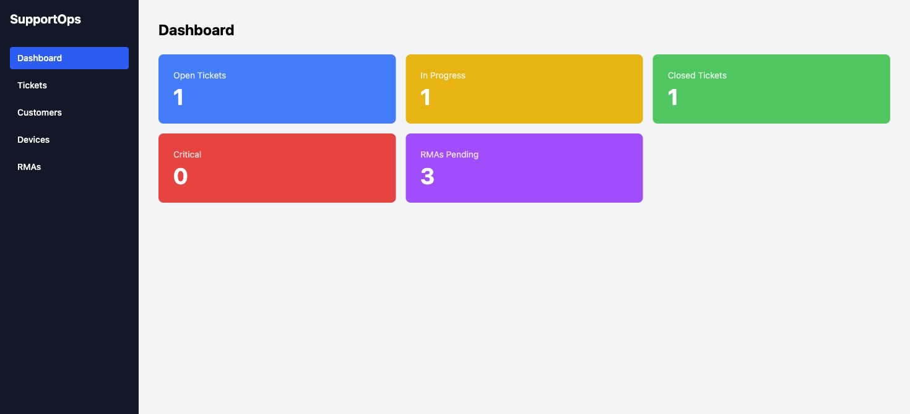
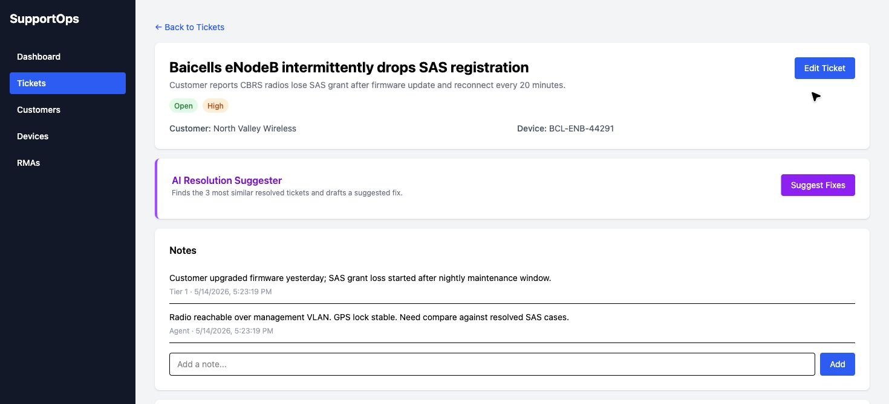
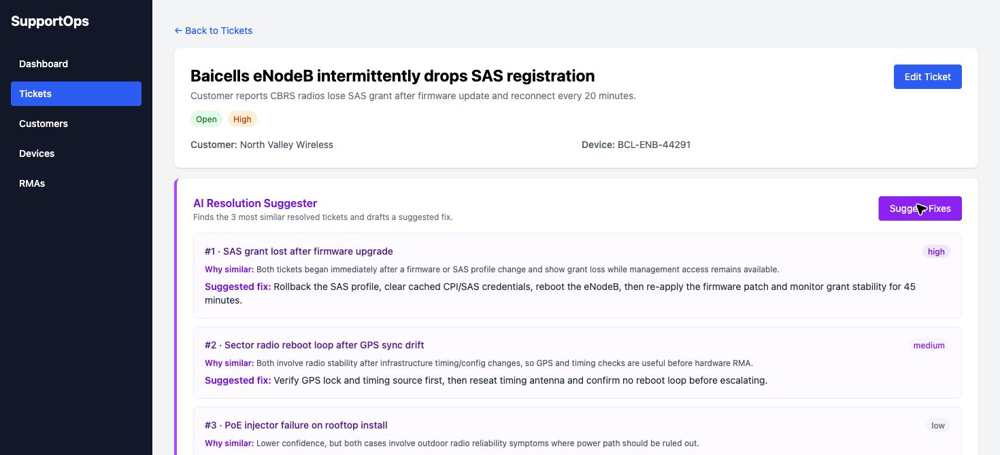

# SupportOps

[](https://github.com/sonnymay/supportops/actions/workflows/ci.yml) [](https://www.python.org/)
[](https://fastapi.tiangolo.com/)
[](LICENSE)
[](https://supportops.vercel.app)

> A lightweight ticketing and RMA workflow tool built by a tech support engineer, for tech support engineers.

**🔗 Live demo:** [supportops.vercel.app](https://supportops.vercel.app)
**📸 Screenshots:** see [below](#screenshots)

---

## Table of contents

- [Why this exists](#why-this-exists)
- [What this code shows](#what-this-code-shows)
- [Features](#features)
- [Stack](#stack)
- [Screenshots](#screenshots)
- [Roadmap](#roadmap)

## Roadmap

- [ ] Email notification on ticket status changes
- [ ] Bulk ticket operations (assign, close, export)
- [ ] SLA timer per ticket with overdue alerts
- [ ] Customer-facing ticket portal
- [ ] Analytics dashboard with resolution time metrics
- [ ] Slack/Teams webhook integration
- [Architecture](#architecture)
- [Local development](#local-development)
- [Deployment](#deployment)
- [API surface](#api-surface)
- [Screenshots](#screenshots)
- [Roadmap](#roadmap)
- [Contributing](#contributing)
- [License](#license)

> ⏱️ **First load can take up to a minute.** The demo backend runs on Render's free tier, which sleeps after 15 min of inactivity. The frontend fires a warm-up ping on app load and shows an informative loading state while the server wakes — so just give it a moment on the first visit. Subsequent requests are <1s.

---

## Why this exists

After 9 years on the front lines of technical support, I kept hitting the same walls with the tools I was given:

- Tickets, customers, and devices lived in three different systems that didn't talk to each other.
- RMA tracking was a spreadsheet someone forgot to update.
- Status changes had no audit trail when a customer asked *"who closed my ticket and why?"*
- The "enterprise" platforms were slow, bloated, and built for managers — not the agent actually working the queue.

SupportOps is the tool I wished I had. Tickets, devices, customers, RMAs, and a full status history — in one place, fast, and built around how support actually works.

---

## What this code shows

If you're reviewing this as a portfolio piece, the interesting bits are:

- **FastAPI + Pydantic** as a thin validation/business-rules layer over Supabase's PostgREST API — no ORM, no schema duplication.
- **Automatic audit logging** — every ticket status change appends a row to `ticket_history` from the API layer, not the client.
- **AI Resolution Suggester** — Anthropic Claude (Haiku) reads a ticket plus its full notes history and proposes next steps. Wired in `backend/ai.py`.
- **Resilient frontend** — `frontend/src/api.js` wraps `fetch` with `AbortController` timeouts, status checks, and a `useApiResource` hook that gives every page the same loading / error / retry UX.
- **Cold-start UX** — the frontend warms the backend on mount and explains the wait, so a sleeping free-tier dyno never silently looks like a broken app.

---

## Features

- 🎫 **Tickets** with status, priority, assignee, and linked customer + device
- 👥 **Customers** directory (name, email, phone, company)
- 💻 **Devices** tied to customers by serial number and product type
- 📝 **Ticket notes** for agent-side context and handoffs
- 🕓 **Automatic status history** — every status change is logged with who and when
- 📦 **RMA tracking** — RMA number, serial, shipping status, resolution status, linked to the originating ticket
- 🤖 **AI Suggestions** — Claude-powered next-step recommendations per ticket

---

## Stack

| Layer    | Tech                                          |
|----------|-----------------------------------------------|
| Frontend | React 19, Vite, Tailwind CSS v4, React Router |
| Backend  | FastAPI (Python 3.11+), Pydantic              |
| Database | Supabase (Postgres + PostgREST)               |
| AI       | Anthropic Claude Haiku 4.5                    |
| Hosting  | Vercel (frontend) · Render (backend)          |

---

## Architecture

```
┌───────────────┐      ┌──────────────┐      ┌──────────────┐
│  React + Vite │ ───▶ │   FastAPI    │ ───▶ │   Supabase   │
│   (Vercel)    │      │   (Render)   │      │ (PostgREST)  │
└───────────────┘      └──────┬───────┘      └──────────────┘
                              │
                              ▼
                       ┌──────────────┐
                       │  Anthropic   │
                       │    Claude    │
                       └──────────────┘
```

The FastAPI layer is intentionally thin — it validates with Pydantic, applies business rules (e.g. writing to `ticket_history` on every status change), proxies CRUD to Supabase's REST API, and brokers calls to Claude for the AI Suggester.

---

## Local development

```bash
docker compose up --build
```

Docker starts the API at `http://localhost:8000`. Create `backend/.env` from `backend/.env.example` before first run.

### Prerequisites

- Python 3.11+
- Node.js 20+
- A Supabase project (free tier is fine) — grab your `SUPABASE_URL` and `SUPABASE_KEY`
- (Optional) An Anthropic API key if you want the AI Suggester to work locally

### Backend

```bash
cd backend
python -m venv .venv && source .venv/bin/activate
pip install -r requirements-dev.txt
pre-commit install
cp .env.example .env   # then fill in SUPABASE_URL, SUPABASE_KEY, ANTHROPIC_API_KEY
uvicorn main:app --reload
```

API runs at `http://localhost:8000`. Health check: `GET /health`. Interactive docs: `/docs`.
Dependency check: `GET /health/dependencies`.
The Supabase table setup lives in `backend/supabase/schema.sql`.

### Frontend

```bash
cd frontend
cp .env.example .env   # set VITE_API_BASE_URL=http://localhost:8000
npm install
npm run dev
```

App runs at `http://localhost:5173`.

---

## Deployment

- **Frontend** — Vercel, SPA rewrites in `frontend/vercel.json`. Env: `VITE_API_BASE_URL`.
- **Backend** — Render web service from `render.yaml` at repo root. Python 3.11.9. Env: `SUPABASE_URL`, `SUPABASE_KEY`, `ANTHROPIC_API_KEY`, `ANTHROPIC_MODEL`. Health check: `/health`.

Free-tier dynos sleep after 15 min of inactivity. The frontend warms the backend on app load — see `frontend/src/api.js` (`warmupBackend`).

---

## API surface

| Resource     | Endpoints                                          |
|--------------|----------------------------------------------------|
| Health       | `GET /health`                                      |
| Dashboard    | `GET /dashboard`                                   |
| Customers    | `GET/POST/PUT/DELETE /customers`                   |
| Devices      | `GET/POST/PUT /devices`                            |
| Tickets      | `GET/POST/PUT /tickets`, `GET /tickets/{id}`       |
| Ticket Notes | `GET /tickets/{id}/notes`, `POST /notes`           |
| Ticket Hist. | `GET /tickets/{id}/history` (auto-appended)        |
| RMAs         | `GET/POST/PUT /rmas`                               |
| AI           | `POST /tickets/{id}/ai-suggestions`                |

Status changes on tickets automatically append a row to `ticket_history`.

Full OpenAPI spec available at `http://localhost:8000/docs` when the backend is running.

---

## Screenshots





---

## Roadmap

- [ ] Full-text search across tickets and notes
- [ ] SLA timers with breach alerts
- [ ] Saved views / filters per agent
- [ ] CSV export of tickets and RMAs
- [ ] Role-based permissions (agent / lead / admin)

---

## Contributing

Issues and PRs are welcome — especially from anyone who's worked a support queue and has opinions on what's missing. Please open an issue describing the change before sending a large PR.

---

## License

[MIT](LICENSE) © Sonny May
